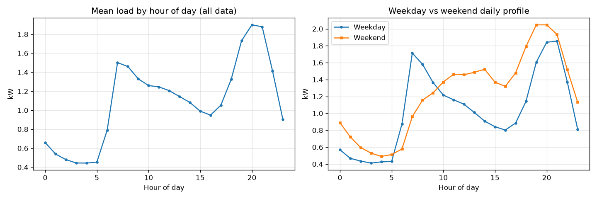
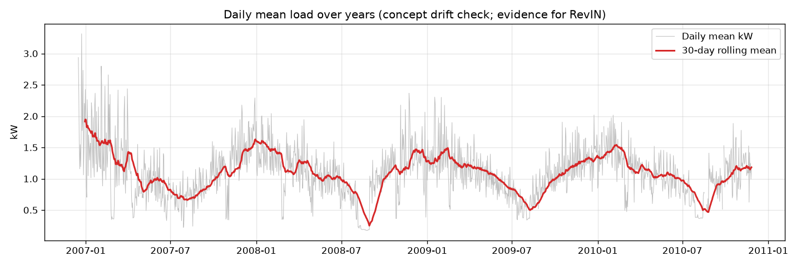
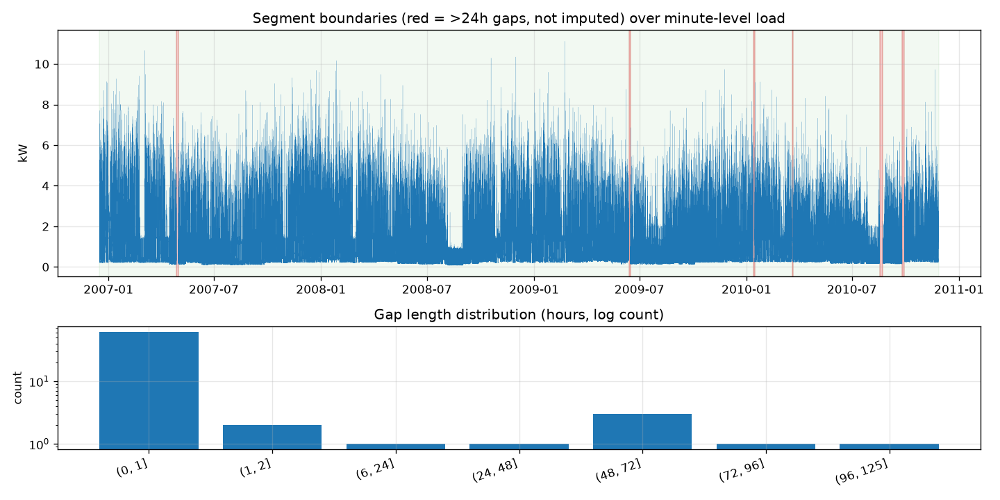
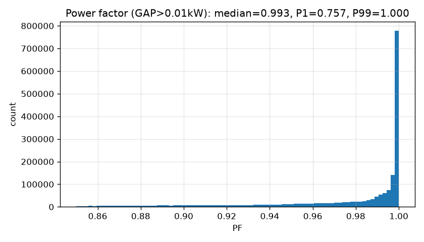
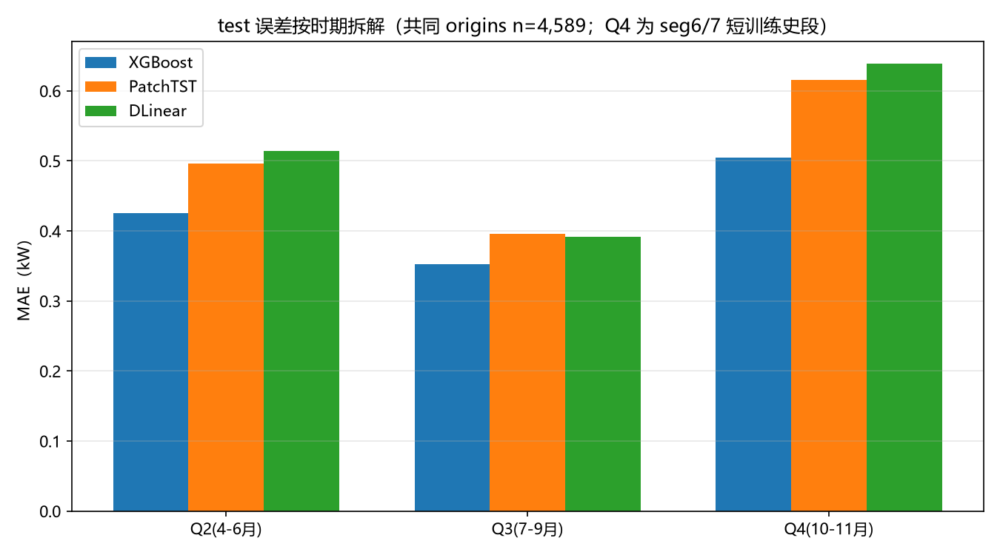
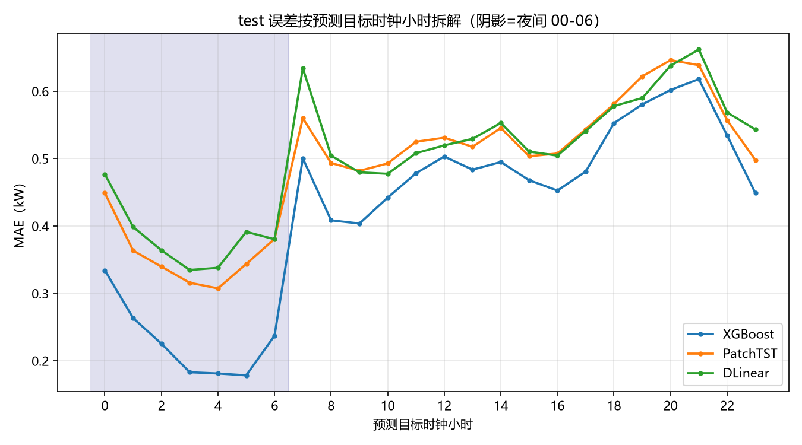
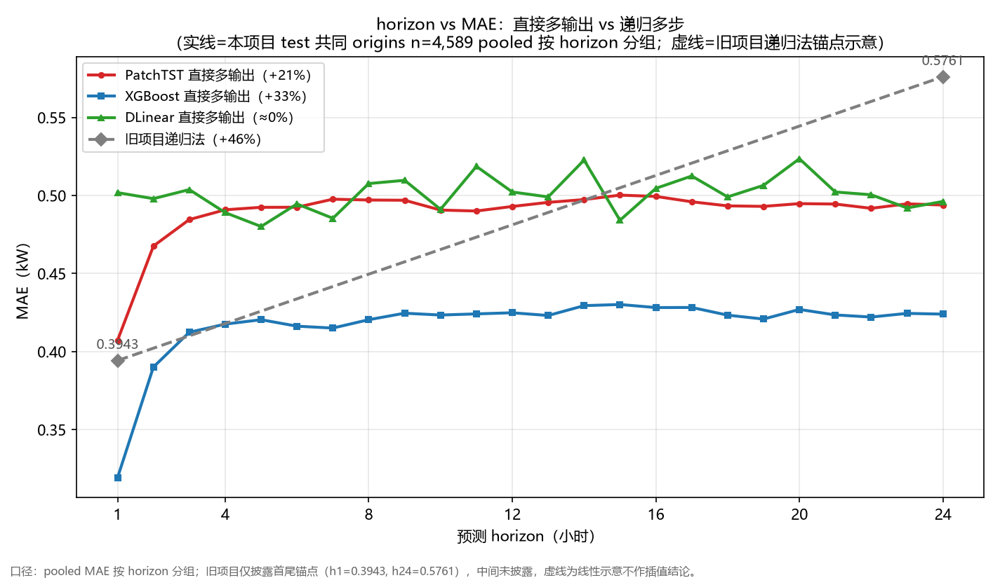

# 家庭负荷小时级预测：PatchTST 论文对齐复现与滚动评估

单变量预测 UCI 家庭用电负荷（`Global_active_power`），小时级重采样，L=168（过去 7 天）→ H=24（次日全天）**直接多输出**（不递归）。用现成库（neuralforecast 3.2.2）实现 PatchTST 并逐项对齐论文 §3.1（Nie et al., ICLR 2023, arXiv:2211.14730），与 DLinear、XGBoost 及无状态基线在**统一滚动 168h 块协议**下对比，并做泄漏专项审查与论文声称逐条核对。

**一句话结论**：小数据 + 强周期 + 概念漂移场景下，**XGBoost（0.4190 kW MAE）胜出**，PatchTST（0.4894）与 DLinear（0.5011）纠缠且均被简单模型压制——与论文表 3 中「DLinear 在 ETT 小数据集多次获胜」的现象同型；PatchTST 的直接多输出确实把递归法的误差累积压平（h1→h24 涨幅 +21% vs 旧项目递归 +46%）。

---

## 1. 项目概览

| 项 | 内容 |
|---|---|
| 数据 | UCI Household Power Consumption，2,075,259 行分钟级（2006-12-16 ~ 2010-11-26），分号分隔，`?` 缺失，有成段空窗（最长数周） |
| 任务 | 单变量 `Global_active_power`；小时级 kW=mean、kWh=sum（分两列）；L=168 → H=24 直接多输出 |
| 硬约束 | 时序不切 shuffle；特征信息可用时间 ≤ 预测时点；scaler 仅训练段 fit；test 只评一次；废弃 MAPE（主指标 MAE，辅助 RMSE/sMAPE）；Sub_metering 只 EDA 不进模型（同时刻分解 = 泄漏） |
| 主口径 | **扁平化整体（pooled）MAE**，horizon 均值同时报告；balanced 时 MAE 两口径数学等价 |
| 评估协议 | 滚动 168h 块：每块只用严格早于块起点的时间序列重训（详见 §4） |
| 硬件 | RTX 4060 Laptop 8GB + R7 7435H；torch 2.6.0+cu124；PatchTST 单 epoch 中位 0.072s、显存峰值 730MB、GPU/CPU ≈ 10.6× |

**test 最终结果（共同 origins n=4,589，pooled）**：

| 模型 | MAE (kW) | R² | RMSE | sMAPE |
|---|---|---|---|---|
| **XGBoost** | **0.4190** | **0.3377** | 0.5775 | 0.4488 |
| ma7_same_hour（无状态） | 0.4341 | 0.2701 | 0.6062 | 0.4617 |
| PatchTST（patch 16/8，lr 5e-4） | 0.4894 | 0.1451 | 0.6560 | 0.5454 |
| DLinear | 0.5011 | 0.1242 | 0.6640 | 0.5538 |
| seasonal_naive（无状态） | 0.5105 | -0.1558 | 0.7628 | 0.4923 |
| persistence（无状态） | 0.6797 | -0.7295 | 0.9331 | 0.6551 |

---

## 2. 数据与清洗

**统计指纹先行**（只输出统计量，不出原始行）：`?` 转 NaN 后输出 shape/dtype/缺失率/分位数/gap 长度分布；>24h 空窗占全数据跨度 **1.19%**（<5% 红线，用户确认不触发分段策略调整）。

**插补规则（确定性，无随机成分）**：

| gap 长度 | 处理 | 标记 |
|---|---|---|
| <2h（共 62 段） | 逐段 `interpolate`（显式 `limit_direction='forward'`，不依赖默认值） | `impute_flag=1` |
| 2–24h（共 1 段） | `ffill` + 标记列 | `impute_flag=2` |
| >24h（共 6 段） | **不插补，作分段边界**；滑动窗口只在各自分段内构造 | `impute_flag=NaN` |

**小时级重采样**：kW=mean、kWh=sum 分两列；小时有效性 = 60 分钟全部有值（含插补值），跨界小时置 NaN 自动成分段边界。清洗产物 `data/processed/minute_clean.parquet`、`hourly.parquet`。

**独立断言脚本**（`scripts/p1b_assert.py`，15 项全 PASS）：行数守恒、时间列严格非递减、关键列无 null、重采样前后 **kWh 能量守恒（偏差 0.033%，容差 <0.5%）**、lag/rolling 特征小样例手工对照。

分段统计：`outputs/p1b_segment_stats.csv`，7 个有效段，可构造建模窗口合计 32,832 个。

---

## 3. EDA 关键发现

四张必含图（`outputs/eda/`）：

1. **日内双峰**（`p2_1_intraday_profile.png`）：早峰 ≈07:00、晚峰 ≈20:00，凌晨 4 点低谷；峰谷差 76%。


2. **工作日/周末**（同图）：工作日早峰 ≈1.7kW 远高于周末 ≈1.2kW——周末行为模式方差大，是误差归因的伏笔（§8）。
3. **按年日均负荷曲线**（`p2_2_yearly_drift.png`）：2006 冬 ≈1.9kW → 2008 夏谷 ≈0.35kW，**年际基线漂移明确**。此图即 **RevIN 必要性的数据证据**：分布随时间系统性漂移，全局统计量（全局 scaler）会失效，窗口级归一化（RevIN）有存在理由。


4. **gap 分布与分段边界**（`p2_3_gaps_segments.png`）：6 个 >24h 空窗全部保留为分段边界，零越界插补。



领域常识校验：功率因数中位 **0.993**（0.9~1 区间内），低 PF 集中在 0.1–1kW 中等负荷（感应电机），非数据错误；Sub_metering 三项合计覆盖 GAP 的 **48.8%**，其余为未分项负荷——确认 EDA-only 决策。



---

## 4. 评估协议：滚动 168h 块（本项目的关键工程决策）

**动机（真实踩坑）**：早期 DLinear 评估用「单次 fit + 跨段 no-refit cross_validation」，在评估跨度 ≫ 训练历史的时段（2010 年段）MAE 爆到 1.2–1.6——模型 stale。诊断确认根因后重构为统一滚动协议。

**协议**（`scripts/eval_rolling.py`）：

- val/test origins 按 168h 分块（语义「每周重训」）；每块**只用严格早于块起点的时间序列重训**，预测该块全部 origins；
- neuralforecast 模型走外部 `fit` + `cross_validation(refit=False, use_fitted=True)`，评估输入用实际观测值（合法滚动预测语义）；
- 跨段块按段拆开（段内小时连续）；段首块训练历史 <168h 无法构造训练窗，跳过并在对比表用共同 origins；
- 无状态基线（persistence/seasonal_naive/ma7）直接用全序列 ≤t 值。

**覆盖**：val 31 块（跳过 2）→ DL 覆盖 4,593/4,929；test 31 块（跳过 2）→ DL 覆盖 4,589/4,925。test origins 只落在数据末三段，其中 seg6/7 段内训练历史先天 ≤8–10 天（数据限制）。

**切分**：按 origin 时间顺序不 shuffle；val ≥ 2009-08-28，test ≥ 2010-04-10；调参只在 val，test 只评一次。

---

## 5. 泄漏排查专节（README 专门小节）

本项目实际抓到并修复的泄漏/近泄漏问题，按时间顺序：

1. **`pf_daily` 黑名单沿革（旧项目教训）**：旧项目曾用**当日**功率因数作特征，R² 虚高至 0.56，修复为前一日值后降至 0.33。本项目将其列入黑名单，全特征逐条审查「信息可用时间 ≤ 预测时点」。
2. **CV 边界泄漏（P3 抓到）**：rolling origin CV 曾把最后一个 fold 的验证窗口设为 test 前 720 origins，违反「CV 只在 test 切分点前滚动」。已改为 test 前 eligible origins 四等分、3 个内部切点；受污染数字作废重跑。教训：CV 边界条件用断言守护。
3. **DLinear no-refit staleness（P3→P4 重构动机）**：见 §4，单次 fit 评估跨年段失效，重构滚动协议。
4. **时间戳单位 bug（P4 抓到，最隐蔽）**：`blocks_of` 原实现用 `times.view('int64')` 按纳秒常量整除分块，但 `hourly.parquet` 读回的索引是 **`datetime64[us]`（微秒）**，整除全部归 0 → **每段塌缩成一块**，滚动退化为「每段单模型」——seg2 用一个只见过 2009-08 前数据的模型预测 137 天，恰好踩中本协议要防的 stale 陷阱；且段首块 167h<168h 被跳过导致 seg3/4 无 DL 预测。修复为 `Timedelta` 整除（单位无关）。教训：**所有时间戳操作显式单位，不假设纳秒**。
5. **滚动协议的两道运行时断言**（外部泄漏审查评价为「全代码最有价值的一行」）：`assert cutoffs == block_times`（预测落位由运行时不变量保证，不是假设）与块窗口数断言 `len(full_df)-len(train_df) == n_win + H`。
6. **早停语义核实**：`early_stop_patience_steps=0` 经查 neuralforecast 3.2.2 源码（`common/_base_model.py:388`，`if early_stop_patience_steps > 0` 门控实例化 EarlyStopping）确认为**禁用早停**，非「首次验证即停」；短史块（无验证集）跑满 max_steps 无截断。

外部审查：窗口构造与滚动协议已通过逐项泄漏专项审计（`use_fitted=True + refit=False` 语义、`train_df = s[s.index < t0]` 严格小于、无状态基线 ≤t 值全部确认）。

---

## 6. scaler / RevIN 分层说明

两个归一化作用层级不同，**互不冲突、不可互相替代**：

| 层 | 服务对象 | 操作 | 泄漏安全性 |
|---|---|---|---|
| 全局 scaler | 基线模型（XGBoost 等）的特征缩放 | 仅在**训练段** fit，transform 验证/测试段；指标在原始量纲计算 | 由「训练段 fit」保证 |
| RevIN | PatchTST/DLinear 的输入归一化 | **窗口级**操作：每个输入窗口独立减均值除标准差，输出阶段还原 | 逐窗口独立、只看输入窗，天然无泄漏；不经过任何全局 scaler（`scaler_type="identity"` 显式禁用） |

**RevIN 的有效性证据与边界**（对应论文声称核对表 C6）：
- 有效性：§3 年漂移曲线证实 2006→2010 强漂移（RevIN 存在理由）；PatchTST 在漂移 test 段存活（R² 0.145 vs persistence -0.73）。
- **边界：RevIN 救漂移、救不了夜间近零值弱信号区**——夜间负荷近零时段窗口归一化后有效信号弱，DL 模型夜间 nMAE 显著高于 XGBoost（PatchTST 0.657 / DLinear 0.705 vs XGBoost 0.421，见 §8 误差归因）。

---

## 7. PatchTST 配置与论文出处逐项对照（硬约束 13a/13b）

| 配置项 | 本项目取值 | 论文出处 | 说明 |
|---|---|---|---|
| patch_len / stride | **16 / 8** | §3.1 | neuralforecast 3.2.2 默认值与论文一致，无冲突 |
| 序列末端补齐 | 库实现（patch 数向上取整） | §3.1「末端补 S 个末值」 | 语义一致 |
| RevIN | **开启**（revin=True） | §3.1 | 窗口级归一化 + 输出还原，见 §6 |
| 训练损失 | **MSE**（显式 `loss=MSE(), valid_loss=MSE()`） | §3.1 | 库默认 MAE，**必须显式改**——评估指标 ≠ 训练损失（13b） |
| 输入全局 scaler | 禁用（`scaler_type="identity"`） | §3.1 设计语义 | 归一化走 RevIN，见 §6 |
| n_heads / encoder_layers / dropout | 16 / 3 / 0.2 | §3.1 | 库默认值与论文一致 |
| d_model / d_ff | 该实现不可调 | — | 库固定值，已在留痕注明 |
| batch_size / max_steps | 256（用户上限）/ 2000 | — | 早停分场景（与 §5 一致）：有验证集块 `early_stop_patience_steps=300`；短训练史块无验证集（val_size=0）时 =0 即**禁用早停**，跑满 max_steps |
| 直接多输出 | h=24 一次输出，不递归 | §3.1 监督预测设置 | 与旧项目递归法对比见 §9 |

随机种子 42 固定；CUDA 不可用时脚本 **FATAL 退出**（禁止静默回退 CPU）。

---

## 8. 误差归因（test，共同 origins n=4,589）

三维拆解（全表 `outputs/p5/error_attribution.csv`，图 `error_by_period.png` / `error_by_hour.png`）：

**时期**（Q4 = 10-11 月 seg6/7 短训练史段）：

| 模型 | Q2（4-6月） | Q3（7-9月夏谷） | Q4（短史段） |
|---|---|---|---|
| XGBoost | 0.426 | 0.353 | **0.505** |
| PatchTST | 0.496 | 0.395 | **0.616** |
| DLinear | 0.514 | 0.392 | **0.639** |

**DL 与 XGBoost 的差距在 Q4 拉到最大（+0.11~0.13）——段内训练历史 ≤8–10 天 + 概念漂移是 DL 落后的主因**；Q3 绝对 MAE 最低纯粹是夏谷负荷水平低（日均 0.705kW）。



**时段**：夜间绝对 MAE 最低（XGBoost 0.229），但 DL 夜间 **nMAE** 最高（0.66–0.70 vs XGBoost 0.42）——近零值区域相对误差放大，即 §6 RevIN 边界；晚间 18–23（峰值区）绝对误差最高。



**周内**：周末 MAE 显著高于工作日（XGBoost 0.510 vs 0.384）——周末行为模式方差大（§3 伏笔坐实）。

**R² 分母效应**：test 目标方差 0.503 仅为 val（0.789）的 **64%**，R² 跨期比较存在分母效应——test R² 低于 val 部分源于分母收窄而非纯预测力下降，**MAE 与 R² 须配对解读**；但 Q4 段方差 0.72 并不低，该段 R² 低是真实预测力问题。

---

## 9. 与旧项目对比、粒度桥接与 horizon 曲线

### 9.1 horizon vs MAE 双曲线（`outputs/p5/horizon_mae_dual_curve.png`）

实线 = 本项目 test 共同 origins n=4,589 直接多输出（pooled 按 horizon 分组）；灰色虚线 = 旧项目递归多步（**仅首尾锚点 0.3943/0.5761 披露，线性示意**）：



| 模型 | h1 | h24 | 涨幅 |
|---|---|---|---|
| XGBoost 直接多输出 | 0.319 | 0.424 | +33% |
| **PatchTST 直接多输出** | 0.407 | 0.494 | **+21%** |
| DLinear 直接多输出 | 0.502 | 0.496 | ≈0% |
| 旧项目递归法 | 0.394 | 0.576 | **+46%** |

「直接多输出压平递归误差累积」验证成立。XGBoost 前 3 小时陡升后持平——h1 优势来自滞后特征对极近步的强预测力。

### 9.2 粒度桥接（日级同口径，`outputs/p5/granularity_bridge.csv`）

23:00 origins 的预测恰为次日完整 24h，聚日均后与旧项目日级 XGBoost（MAE 0.1877 / R² 0.3347）同口径。统一基于 DL 共同覆盖的 **191 天**：

| 模型 | 日均 MAE (kW) | 日均 R² |
|---|---|---|
| XGBoost | 0.1504 | 0.5268 |
| DLinear | 0.1712 | 0.4255 |
| PatchTST | 0.1866 | 0.3442 |
| （参照）旧项目日级 XGBoost | 0.1877 | 0.3347 |

PatchTST 小时级模型在日粒度上与旧项目日级模型几乎打平；XGBoost 桥接后明显优于旧项目。口径差异注意：桥接基于 test 段（2010-04~11），旧项目为全数据日级切分，**此对比作叙事桥接、不作严格胜负判据**；小时级 MAE 仍是主结果。

### 9.3 教学案例：日粒度排序翻转

小时级 PatchTST（0.4894）优于 DLinear（0.5011），但日粒度桥接下 **DLinear 反超（0.1712 vs 0.1866）**——与 horizon 曲线互证：DLinear 的 h1→h24 涨幅 ≈0% 本质是接近常数外推，日均聚合天然给它占便宜。**聚合粒度会改变模型排序**，对比时必须先对齐粒度（这正是旧项目日级 MAE 不能直接并排小时级 MAE 的原因）。

### 9.4 新旧对比全表

见 `outputs/p5/new_old_comparison.csv`（11 行：新项目 6 行 + 桥接 3 行 + 旧项目锚点 2 行，无缺行）。要点：

- 旧项目日级 XGBoost（0.1877）**落后其朴素基线（7 日均，0.1798）约 0.008kW**——日粒度下特征增益未覆盖复杂度成本，这是本项目转向小时级的核心动机之一。
- **MAPE 口径差异声明**：旧项目 MAPE=21.15% 与本项目 sMAPE 是**不同指标**（分母分别为真值 / \|真值\|+\|预测\|，本项目废弃 MAPE 因夜间近零值失真），对比表中分两列标注、禁止混排。旧项目小时级单步 XGBoost（MAE 0.3238 / R² 0.5905）口径不同，仅此处注明、不进对比表。
- XGBoost 特征 Top3（hour 0.196 / roll_mean_168h 0.098 / dow 0.072，24 输出平均 importance，**代表性单配置重训，非全块平均**）：`outputs/p5/xgb_feature_importance.csv`。

---

## 10. 论文声称 vs 我的数据（`outputs/p5/paper_claims_check.csv`，7 条）

> 论文逐节解读与复现验证详版笔记：[docs/paper_notes.md](docs/paper_notes.md)

| 声称 | 判定 | 一句话结果 |
|---|---|---|
| C1 监督 PatchTST 优于此前 Transformer（表 2-3） | 未验证（范围外） | 未实现 Informer/Autoformer 对照；时间盒优先保基线组完整与泄漏审查 |
| C2 长 lookback 受益（336/512 最优） | 未验证（范围外） | L=168 由任务定义锁定，未做 lookback 消融 |
| C3 patching 与 CI 缺一不可 | 部分/不适用 | 单变量通道数=1，CI 无适用性；patching 维度见 C4 |
| C4 patch 长度影响 | 部分复现（方向中性） | **OPT-1：24/12 改善 0.0069 kW（1.2%），不改变模型间排序与量级差距，瓶颈在数据规模与漂移而非配置** |
| C5 DLinear 在 ETT 多次胜 PatchTST（表 3） | 部分复现 | 小时级 PatchTST 略胜（2.4%）、日粒度 DLinear 反超；两模型纠缠且均被简单模型压制——同型现象成立，严格胜负方向未复现 |
| C6 RevIN 对分布漂移的作用 | 部分复现 + 边界 | 年漂移曲线证实漂移存在；RevIN 救漂移、救不了夜间近零值弱信号区（§6） |
| C7 自监督预训练优势（摘要） | 未复现 | ① 3.5 万点单变量小数据，论文自身定位该优势在大数据集显著；② GPU 6h 预算已用约 5h；③ 预训练+微调路径超出时间盒 |

---

## 11. OPT-1 消融登记（已关闭）

- 触发：用户明确解锁，**仅 val 单次**（patch 24/12 vs 论文默认 16/8，lr 不动，未联动任何其他超参），test 未重跑。
- 结果（val 共同 origins n=4,593，pooled）：16/8 → MAE 0.5788 / R² 0.2303 / RMSE 0.7780；24/12 → MAE 0.5719 / R² 0.2488 / RMSE 0.7686。**改善 0.0069 kW（1.2%），不改变模型间排序与量级差距，瓶颈在数据规模与漂移而非配置**。
- 处置：不推翻已收官 test 结论（test 仍报 16/8 配置）；消融维度关闭。落盘 `outputs/p5/ablation_patch_24_12_val.csv`。

---

## 12. 已知限制

1. **seg6/7 短训练史**：test origins 落在数据末三段，seg6/7 段内训练历史先天 ≤8–10 天（数据限制），DL 与 XGBoost 同受限，是误差归因的主轴（§8）。
2. **段首 7 天无 DL 预测**：每段首块训练历史 167h<168h，无法构造训练窗，按协议跳过；val/test 各 336 origins，对比表用共同 origins 规避。
3. **未覆盖的论文声称**：C1/C2 对照模型与 lookback 消融因时间盒未做（§10），不作方向性结论。
4. **R² 跨期不可直接比**：分母效应（§8），须与 MAE 配对解读。
5. **滚动协议成本**：31 块 × 每周重训，DL 单配置全程约 75 分钟 GPU；更大规模数据需重谈时间盒。

---

## 13. 复现步骤

**0. 数据获取**：从 UCI 官方页面下载数据集（https://archive.ics.uci.edu/dataset/235/individual+household+electric+power+consumption ，约 127 MB），解压后将 `household_power_consumption.txt` 放到 `data/` 下（详见 `data/README.md`）。

环境（`pip install -r requirements.txt`，版本已锁死）：Python 3.11.9 ｜ pandas 2.3.3 ｜ numpy 2.3.2 ｜ torch 2.6.0+cu124 ｜ neuralforecast 3.2.2 ｜ xgboost 3.2.0 ｜ scikit-learn 1.9.0 ｜ matplotlib 3.11.1 ｜ pyarrow 25.0.1。GPU 非必需（CUDA 不可用时 DL 脚本会 FATAL 退出而非静默回退，需先装 CUDA 版 torch）。

```bash
# P1a 统计指纹（只输出统计量）
python scripts/p1a_fingerprint.py
# P1b 清洗 + 独立断言（15 项）
python scripts/p1b_clean.py && python scripts/p1b_assert.py
# P2 EDA 四图
python scripts/p2_eda.py
# P3 基线组 + rolling origin CV + 双路径核对（可加 --start/--end 跑门禁子集）
python scripts/p3_run.py
# P4 滚动评估（val 调参 / test 只评一次；DL 需 CUDA）
python scripts/eval_rolling.py --model xgboost --mode val --run-id xgb_base
python scripts/eval_rolling.py --model patchtst --mode val --run-id ptst_lr5e4 --lr 5e-4 --max-steps 2000
python scripts/eval_rolling.py --model dlinear  --mode val --run-id dlinear_base
python scripts/eval_rolling.py --model xgboost --mode test --run-id xgb_base
python scripts/eval_rolling.py --model patchtst --mode test --run-id ptst_lr5e4 --lr 5e-4 --max-steps 2000
python scripts/eval_rolling.py --model dlinear  --mode test --run-id dlinear_base
# 消融（已关闭，留档命令）
python scripts/eval_rolling.py --model patchtst --mode val --run-id ptst_lr5e4_p2412 --lr 5e-4 --max-steps 2000 --patch-len 24 --stride 12
# P5 统一对比（共同 origins + 无状态基线 + 双路径核对）
python scripts/p5_compare.py test
```

随机种子 42 固定（`SEED`）；时间戳操作全部显式单位（`pd.Timedelta` 整除，不用裸 `view('int64')`）。

---

## 14. 留痕清单

| 文件 | 内容 |
|---|---|
| `decisions.md` | 全程决策 + 理由（跨会话续接用，含断电断点备忘） |
| `项目阶段与步骤详解.md` | P1a–P5 逐步骤记录（目的/产出/预期 vs 实际/面试 30 秒版） |
| `training_log.csv` | 逐 epoch 耗时/显存/loss（19 万行） |
| `outputs/p5/compare_test.csv` | test 统一对比（共同 origins + 双路径核对记录） |
| `outputs/p5/horizon_mae_test.csv` / `horizon_mae_dual_curve.png` | horizon 数据与双曲线 |
| `outputs/p5/granularity_bridge.csv` | 粒度桥接（n=191 统一） |
| `outputs/p5/new_old_comparison.csv` | 新旧对比全表 |
| `outputs/p5/error_attribution.csv` / `error_by_period.png` / `error_by_hour.png` | 误差归因 |
| `outputs/p5/paper_claims_check.csv` | 论文声称对照（7 条） |
| `outputs/p5/ablation_patch_24_12_val.csv` | OPT-1 消融 |
| `outputs/p5/xgb_feature_importance.csv` | 特征 importance（代表性单配置重训） |
| `outputs/p5/*_pred.npy` | 各模型 val/test 预测（origins+24 步） |
| `outputs/p4/*.log` | 滚动评估逐块日志 |
| `outputs/eda/*.png` | EDA 四图 |
| `outputs/p1b_segment_stats.csv` | 分段统计 |
| `outputs/p5/final_test_*.npy` | 主会话整理的 test 预测便捷副本（XGB 行为共同 origins 子集） |
| 本地留痕件（不入库） | npy 预测数组（`outputs/p5/*_pred.npy`）、`training_log.csv`、`outputs/p4/ptst_*.log` 逐块日志、parquet 缓存——体积大且可由 §13 脚本复现，由 `.gitignore` 排除 |

过程文档、泄漏审计记录（逐项审计结果）与所有门禁确认均在会话 decisions.md 中留档。
